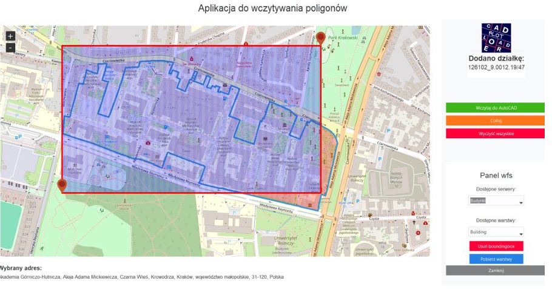
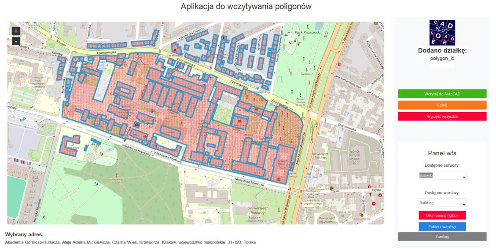
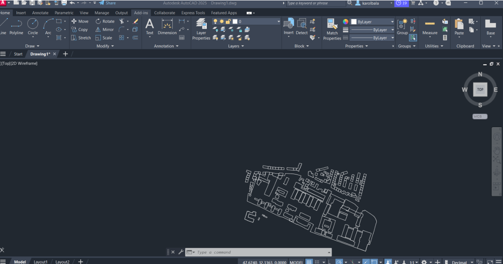

# AutoCAD Plot Loader


---

**AutoCAD Plot Loader** is a Python-based desktop application designed to load and display geographic polygons on an interactive map. The application allows users to fetch polygon data from **Web Feature Service (WFS)** servers, visualize the polygons on a map, and export them to **AutoCAD** for further editing or use in CAD projects. The application is built using modern Python libraries and provides a user-friendly interface for managing geographic data.

---
## Installation

1. Clone the repository:
   ```bash
   git clone https://github.com/your-username/AutoCAD-Plot-Loader.git
   cd AutoCAD-Plot-Loader# AutoCAD Plot Loader

---


## Key Features

1. **Interactive Map**:
   - Displays an interactive map using the `tkintermapview` library.
   - Users can click on the map to add markers, draw bounding boxes, and load polygons.

2. **WFS Integration**:
   - Fetches geographic data (e.g., administrative units, buildings, transport networks) from **WFS servers**.
   - Supports multiple WFS services, which can be configured in a JSON file (`wfs_services.json`).

3. **Polygon Visualization**:
   - Loads and displays polygons on the map.
   - Supports drawing bounding boxes to define areas of interest.

4. **AutoCAD Export**:
   - Exports the displayed polygons to **AutoCAD** as lightweight polylines.
   - Automatically converts coordinates from **EPSG:4326** (WGS84) to **EPSG:2180** (Polish coordinate system) for compatibility with AutoCAD.

5. **User-Friendly Interface**:
   - Built using `ttkbootstrap` for a modern and themed GUI.
   - Provides buttons for common actions like adding polygons, deleting polygons, and exporting to AutoCAD.

6. **Geocoding**:
   - Retrieves the user's current location based on their IP address.
   - Converts map coordinates to human-readable addresses using the `geopy` library.

7. **Coordinate Transformation**:
   - Converts coordinates between **EPSG:2180** and **EPSG:4326** using the `pyproj` library.

---

## Use Cases

- **Restrictions**: the application fetches data from WFS (Web Feature Service) servers that are specific to Poland. These services are provided by Polish institutions (e.g., the Polish Head Office of Geodesy and Cartography) meaning that the application is currently designed to work only within Poland .

- **Urban Planning**: Load and visualize building footprints, administrative boundaries, or transport networks for urban planning projects.
- **CAD Integration**: Export geographic data to AutoCAD for use in technical drawings or construction plans.

---

## How It Works

1. **Map Interaction**:
   - Users can click on the map to add markers or draw bounding boxes.
   - The application retrieves the address of the clicked location using reverse geocoding.
   - Users can click on map to retrieve boundaries of clicked plot using ULDK, fetched data will then be displayed on the map     

2. **WFS Data Fetching**:
   - Users can select a WFS service and a specific layer (e.g., buildings, transport networks) from a dropdown menu.
   - The application fetches the data from the WFS server and displays the polygons on the map.

3. **Polygon Export**:
   - Users can export the displayed polygons to AutoCAD with a single click.
   - The application automatically converts the coordinates to the required format and sends the data to AutoCAD.

4. **Coordinate Transformation**:
   - The application handles coordinate transformations between **EPSG:2180** (used in Poland) and **EPSG:4326** (used in most mapping applications).

## Application Usage Instructions

### 1. **Loading Parcel Data (ULDK)**
   - To load information about a specific parcel:
     1. Click on the desired point on the map.
     2. After a short moment, a polygon representing the parcel will appear on the map.
     3. The number of the last added parcel will be displayed on the right side of the interface.

---

### 2. **Managing Polygons**
   - **Undo Button**: Click to remove the last added polygon from the map.
   - **Clear All Button**: Click to remove all polygons from the map.

---

### 3. **Loading Objects from WFS Servers**
   - To load objects from WFS servers:
     1. Click the blue button to open the WFS panel.
     2. Define a **Bounding Box** by selecting two diagonal points on the map:
        - Right-click on the map and select **"Add Bounding Box Corner"**.
        - Repeat to add the second point.
     3. A rectangle representing the Bounding Box will appear on the map.
     4. **Note**: You cannot add more than two points. To reset, delete the Bounding Box.
   
   **Screenshot: Selecting WFS Layers**  
   


---

### 4. **Selecting WFS Layers**
   - After defining the Bounding Box:
     1. Select the desired layer from one of the predefined WFS servers.
     2. You can add your own WFS server by editing the `wfs_services.json` file and adding the appropriate URL.
     3. Click **"Load Layers"** to load the objects.
     4. The selected objects will be added to the map.
   
   **Screenshot: Selecting WFS Layers**  
   

---

### 5. **Exporting to AutoCAD**
   - Once all desired objects are added to the map:
     1. Click **"Load to AutoCAD"** to export them to AutoCAD (version 2025 by default).
     2. The objects are automatically transformed to the **EPSG:2180** coordinate system.
     3. **Note**: The transformation process may take some time, as each point must be converted.
      **Screenshot: Exporting to AutoCAD**  
      
---

### 6. **Known Issues**
   - Some WFS layers may not work correctly. For example:
     - Roads may return an exception from the server.
     - However, road areas from the same server may work correctly.
---

## Technologies Used

- **Python**: The core programming language used for the application.
- **Tkinter**: The standard Python GUI library, enhanced with `ttkbootstrap` for modern styling.
- **TkinterMapView**: A library for displaying interactive maps in Tkinter.
- **Geopy**: For geocoding and reverse geocoding (converting coordinates to addresses).
- **PyProj**: For coordinate transformations between different coordinate systems.
- **Shapely**: For working with geometric objects (e.g., polygons, points).
- **Requests**: For making HTTP requests to WFS servers.
- **BeautifulSoup**: For parsing XML responses from WFS servers.
- **PyWin32**: For interacting with AutoCAD via COM automation.
- **Pillow**: For image processing (e.g., resizing the application icon).

---

## Installation

1. Clone the repository:
   ```bash
   git clone https://github.com/your-username/AutoCAD-Plot-Loader.git
   cd AutoCAD-Plot-Loader
